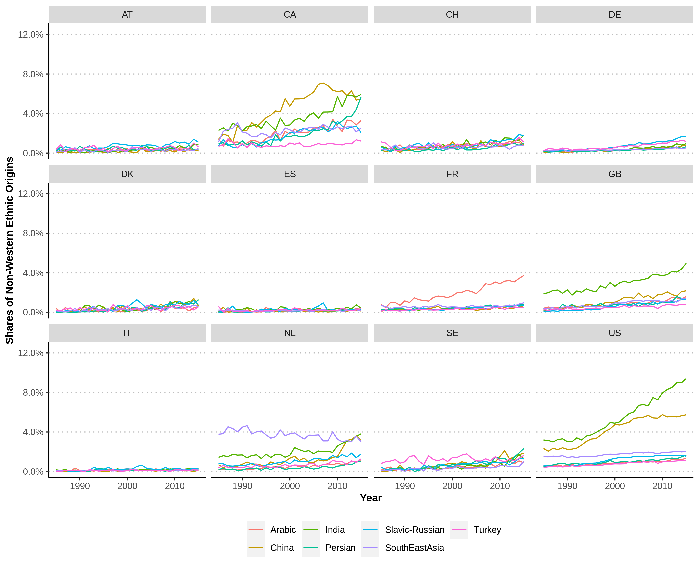

---
output:
  html_document:
    includes:
     after_body: "https://innoscape.de/general_stuff/footer.html"
    title: "inventor_ethnicity"
    self_contained: false
    theme: null
    css: "style.css"
    highlight: null
    mathjax: null
---
<head>
<script async src="https://www.googletagmanager.com/gtag/js?id=UA-71167447-1"></script>

<script>
  window.dataLayer = window.dataLayer || [];
  function gtag(){dataLayer.push(arguments);}
  gtag('js', new Date());
  gtag('config', 'UA-71167447-1', { 'anonymize_ip': true });
</script>

<div class="container-fluid main-container">

<meta property='og:title' content='XXXXX'/>
<meta property='og:image' content='https://innoscape.de/XXXXX/XXXXX.jpg'/>
<meta property='og:description' content='XXXXX'/>
<meta property='og:url' content='https://innoscape.ch/en/publications/XXXXX'/>
</head>

<!-- START with text -->

### **TITLE**

<p style="text-align: left; line-height: 100%;">
*December 2021* by <a href="#" data-placement="bottom" data-toggle="tooltip"  data-html="true" title="<b>Matthias Niggli</b> is a project collaborator. He has a background in public policy from previous positions at the Swiss Federal Institute of Intellectual Property (IPI) and the Swiss State Secretariat for Economic Affairs (SECO). He has a special interest in experimenting with all kinds of machine-learning methods and is enthusiastic about discovering novel approaches to visualize data. 
<br> 
<a href='https://www.linkedin.com/in/matthias-niggli-b47b33119' target = “_blank”>LinkedIn</a> 
<br>
<a href='mailto:matthias.niggli@unibas.ch'>matthias.niggli@unibas.ch</a>">*Matthias Niggli*</a> *and* <a href="#" data-placement="bottom" data-toggle="tooltip"  data-html="true" title=" <b>Christian Rutzer</b> is the chief scientist and operational manager of the project. He holds a PhD in economics from the University of Basel in international trade and innovation. Christian likes to apply new methods from data science to analyze economic questions.
<br>
<a href='https://www.linkedin.com/in/christian-rutzer-38978392' target = “_blank”>LinkedIn</a> 
<br>
<a href='mailto:christian.rutzer@unibas.ch'>christian.rutzer@unibas.ch</a>">*Christian Rutzer*</a>
</p>


<!-- TITLE PICTURE -->
<!-- {width=100%}  -->
<!-- <a href="XXXXX" target = "_blank">XXXXX</a>  -->


<br>

<!-- TEASER ABSTRACT -->
**[Teaser/Abstract]**  

<br>

Since 2010, around half of the Nobel Prizes in Physics, Chemistry and Medicine were awarded to researchers working at research institutions in the USA. This clearly makes the USA the leading hub for academic research in the world. But it had help from abroad to get there: Around 40\% of U.S.-based Nobel prize winners in this time window were *not* born in the USA. This means the country benefited from a substantial <a href=https://en.wikipedia.org/wiki/Human_capital_flight#Brain_gain target = “_blank”>brain gain</a> of researchers from other countries (who often immigrate already as PhD students or post-Doc’s, see e.g. <a href =https://direct.mit.edu/rest/article-abstract/95/2/698/58091/Chinese-Graduate-Students-and-U-S-Scientific target = “_blank”>Ganguli and Piacentini, 2013 </a>; <a href=https://www.science.org/doi/full/10.1126/science.321.5886.185 target = “_blank”>Mervis, 2008</a> or <a href=https://direct.mit.edu/rest/article-https://www.science.org/doi/abs/10.1126/science.285.5431.1213 target=“_blank”>Levin and Stephan, 1999</a>).

<br>

This brain gain for the USA is not restricted to academia. It can also be seen when looking at the ethnic composition of patent inventors. Traditionally, patenting in the USA was strongly dominated by inventors of Anglo-Saxon and—although to a (much) smaller extent—continental European origins. In recent times, this has no longer been the case to the same extent. Especially the share of inventors with Chinese, Indian and other non-western backgrounds has strongly increased since the 1990s and as a result, a substantial fraction of today’s U.S.-based inventors is not of the dominant Anglo-Saxon origin anymore (see <a href=https://www.hbs.edu/ris/Publication%20Files/Kerr%20WP08_EthMatch_f657d992-cf76-4b76-8b52-61cac126b5a8.pdf target = “_blank”>Kerr, 2008</a> for a seminal analysis of the ethnic composition of inventors in the USA). But did this trend also emerge in other high-income countries, especially in Western Europe? We can investigate this question using a deep learning algorithm that classifies patent inventors’ ethnic origins based on their names (interested readers can get more information on the methodological details here). This allows us to examine the ethnic composition of inventors beyond the USA and for a long period of time. Figure 1 plots the prevalence of inventors with different ethnic origins for 12 high-income countries.

<!-- METHODOLOGY BOX / LINK TO PAPER -->
<!-- <details> -->
<!--   <summary>*Click here to get a detailed description of how we detect mRNA-patents*</summary> -->
<!-- <embed src="https://drive.google.com/file/d/1fq3oiSNQVscQ4m8AnzCHEbl0IyTK2j-Y/preview" width="100%" height="600"> -->
<!-- </details> -->

<br>

<hr class="hr_red">
#### **Figure 1: XXXX*
```{r, echo=FALSE}

```
<span style="font-size:0.8em">*Sources and notes: Own estimations of the <a href="https://www.cieb.unibas.ch" target ="blank">CIEB</a> using data on inventors stated on patents at the USPTO or EPO. The raw data is obtained from the <a href="https://www.uspto.gov/" target ="blank">USPTO</a> and the <a href=https://stats.oecd.org/index.aspx?queryid=79486# target = “_blank”>OECD</a>.*</span>

<br>

<!-- HIGHLIGHT -->
<div class=bloc_div>
<blockquote>***In continental European countries, the prevalence of non-western origin inventors is on a much lower level compared to the USA***</blockquote>
</div>

<br>

The main take-away is a remarkable difference between North American and European countries, with the United Kingdom and the Netherlands somewhere in between. Similar to the USA, Canada has also witnessed a stark increase of the prevalence of non-western inventors (although the absolute numbers are on a much smaller level). But most continental European countries look rather different. For example, France has experienced a significant increase of Arabic inventors, but all other non-western ethnic groups remained on relatively low levels. In Germany, the prevalence of inventors with Turkish or Slavic-Russian origins has somewhat increased. Similarly, slight increases for some non-western ethnic groups can also be found in Switzerland, Sweden, Austria and Denmark. However, in all these continental European countries, the increasing prevalence of non-western origin inventors is on a much lower level compared to the USA. The contrast is even more pronounced in southern European countries like Italy and Spain.

<br>


Another interesting aspect is to which fields and industries these non-western inventors have predominantly gone. Figure 2 illustrates the combined prevalence of the 7 ethnic origins in 13 broad technological fields for the same 12 countries.

<br>

<hr class="hr_red">
#### **Figure 2: XXXX**
```{r, echo=FALSE}
library("htmltools")
htmltools::includeHTML("plot2.html")
```
<span style="font-size:0.8em">*Sources and notes: Own estimations of the <a href="https://www.cieb.unibas.ch" target ="blank">CIEB</a> using data on inventors stated on patents at the USPTO or EPO. The raw data is obtained from the <a href="https://www.uspto.gov/" target ="blank">USPTO</a> and the <a href=https://stats.oecd.org/index.aspx?queryid=79486# target = “_blank”>OECD</a>. The processed data shown in the plot is available on <a href="https://github.com/cieb-unibas/inventor_ethnicity" target ="blank">Github</a>.*</span>

<br>

<!-- HIGHLIGHT -->
<div class=bloc_div>
<blockquote>***The vast increase of non-western inventors in the USA has been strongly directed towards emerging high-technology fields***</blockquote>
</div>

<br>

It becomes immediately clear that there is substantial heterogeneity across technological fields. In the USA, the prevalence of non-western inventors is much higher in emerging high-technology fields such as Computer Technology or Information and Communication Technologies. This pattern cannot be observed in European countries, where such technology fields generally do not have a substantially higher prevalence of non-western inventors. This suggests that in contrast to European countries, the vast increase of non-western inventors in the USA has been strongly directed towards emerging high-technology fields.

<br>

The natural question is whether European policymakers should be concerned because of these differences. There is no final answer to this, but researchers have shown that immigration and diversity can influence innovative activity and growth through several channels. First of all, companies consider the access to highly skilled talents when deciding on locations for their research and development activities (<a href=https://link.springer.com/article/10.1057/jibs.2008.92 target = “_blank”> Lewin, Massini and Peeters, 2009</a>) and more diverse inventor teams seem to directly enhance inventive output of firms (see <a href=https://www.sciencedirect.com/science/article/abs/pii/S0048733319300824 target = “_blank”>Ferucci and Lissoni, 2019</a> or <a href=https://link.springer.com/article/10.1007/s00148-013-0491-7 target = “_blank”>Parrotta, Pozzoli and Pytlikova, 2014</a>). More generally, immigration also fosters innovation at the country-level (see e.g., <a href=https://www.aeaweb.org/articles?id=10.1257/aer.p20171021 target = “_blank”>Akcigit, Grigsby and Nicholas, 2017</a> or <a href=https://www.nber.org/papers/w27075 target = “_blank”>Burchardi, Chaney, Hassan, Tarquinio and Terry, 2020</a> for the USA and <a href=https://papers.ssrn.com/sol3/papers.cfm?abstract_id=3728867 target = “_blank”>Cristelli and Lissoni, 2020</a> or <a href=https://www.sciencedirect.com/science/article/abs/pii/S0048733318302737 target = “_blank”> Fassio, Montobbio, and Venturini, 2019</a> for Switzerland and European countries). Hence, there is strong evidence that immigration can contribute to a country’s innovation capabilities. The USA’s extraordinary attractiveness for inventors from all around the world could thus be an important asset that is lacking in European countries.

<br>

Why do we observe these differences between North America and Europe? One could argue that these differences simply reflect that the USA has always been an immigrant and more diverse country, and the higher prevalence of non-western inventors simply reflects this fact. Although this surely plays a role, it can be shown that actual migration was a much more important factor. Using data from the <a href="https://www.wipo.int/publications/en/details.jsp?id=3952&plang=EN" target ="blank">World Intellectual Property Organization WIPO</a>, Figure 3 highlights that the USA has experienced a vast inflow of foreign inventors over the last decades and was by far the largest net receiving country of migrating inventors.

<hr class="hr_red">
#### **Figure 3: XXXX**
```{r, echo=FALSE}
knitr::include_graphics("plot3.png")
```
<span style="font-size:0.8em">*Sources and notes: Graph taken from <a href="https://www.aeaweb.org/articles?id=10.1257/jep.30.4.83" target ="blank">Kerr et al. (2016)</a> based on data from the <a href="https://www.wipo.int/publications/en/details.jsp?id=3952&plang=EN" target ="blank">World Intellectual Property Organization WIPO</a>*</span>

<br>

Hence, there must be other factors than only historical patterns that explain differences between continental European countries, Canada and the USA. Some candidate reasons that all contribute are the English language as a *lingua franca* (e.g. <a href=https://ftp.iza.org/dp1782.pdf target=”_blank”>Chiswick, 2005</a>), the access to and attractiveness of universities (e.g. <a href= https://direct.mit.edu/rest/article-abstract/95/1/109/58045/Quotas-and-Quality-The-Effect-of-H-1B-Visa target=”_blank”>Kato and Sparber, 2013</a>), tax incentives (<a href=https://www.aeaweb.org/articles?id=10.1257/aer.20150237 target=”_blank”> Akcigit, Baslandze and Stantcheva, 2016</a>), and, last but not least, immigration policies (e.g. <a href= https://www.journals.uchicago.edu/doi/full/10.1086/705637 target=”_blank”>Kerr, 2020</a>). Some of these channels, such as the language, can obviously not be influenced by policymakers. However, the access to universities for foreign students as well as immigration regulations are within their reach and could be adapted to attract more foreign talents.

<br>

<!-- ADAPT when posted on Social Media -->
<!-- <br> -->
<!-- <hr class="hr_red"> -->
<!-- <p style="text-align: left; line-height: 150%;"> -->
<!-- **Did you enjoy this article?** -->
<!-- <br> -->
<!-- Share it with your friends and colleagues on Social Media -->
<!-- <br> -->
<!-- <a href='https://twitter.com/cieb_unibas/status/1451443201412198401' class="fa fa-twitter" style='color:black;text-decoration: none; font-size:28px;' target='_blank'></a> -->
<!-- &nbsp; &nbsp;  -->
<!-- <a href='https://www.linkedin.com/sharing/share-offsite/?url=https://www.linkedin.com/feed/update/urn:li:activity:6857209327149690880/' class="fa fa-linkedin" style='color:black;text-decoration: none; font-size:28px;' target='_blank'></a> -->
<!-- </p> -->

<!-- TEASER OTHER OUTPUTS -->
<!-- <br> -->
<!-- <div> -->
<!-- <iframe id="slider" width=100%" height="400" scrolling="no" frameBorder="0" style="overflow: hidden" src="https://innoscape.de/general_stuff/teaser/mrna_teaser.html"> -->
<!-- </iframe> -->
<!-- </div> -->


<!-- FINAL REMARKS -->
<br class='br_desktop'>
<span style="font-size:0.8em">*This article was written using <a href = https://rmarkdown.rstudio.com/ target = “_blank”>R Markdown</a>, <a href=https://shiny.rstudio.com/ target = “_blank”>R shiny</a> and <a href=https://plotly.com/javascript/ target = “_blank”>Plotly</a>. Computations to generate the data were performed at <a href = http://scicore.unibas.ch/ target = “_blank”> sciCORE </a> scientific computing center at the University of Basel.*</span>

<br>
<br>

<!-- SOCIAL MEDIA CHANNELS -->
<script>
$(document).ready(function(){
  $('[data-toggle="tooltip"]').tooltip();   
});
</script>


