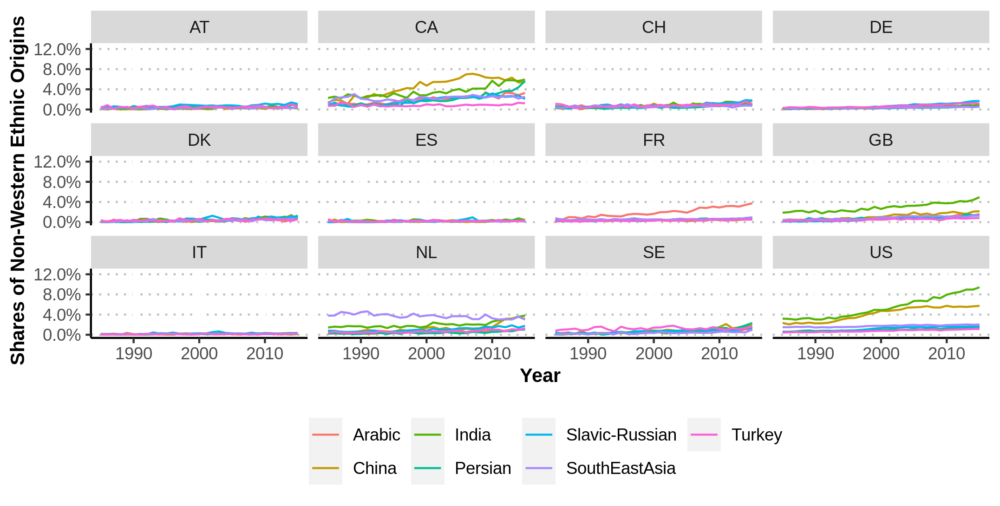

---
output:
  html_document:
    includes:
     after_body: "https://innoscape.de/general_stuff/footer.html"
    title: "inventor_ethnicity"
    self_contained: false
    theme: null
    css: "style.css"
    highlight: null
    mathjax: null
---
<head>
<script async src="https://www.googletagmanager.com/gtag/js?id=UA-71167447-1"></script>

<script>
  window.dataLayer = window.dataLayer || [];
  function gtag(){dataLayer.push(arguments);}
  gtag('js', new Date());
  gtag('config', 'UA-71167447-1', { 'anonymize_ip': true });
</script>

<div class="container-fluid main-container">

<meta property='og:title' content='XXXXX'/>
<meta property='og:image' content='https://innoscape.de/XXXXX/XXXXX.jpg'/>
<meta property='og:description' content='XXXXX'/>
<meta property='og:url' content='https://innoscape.ch/en/publications/XXXXX'/>
</head>

<!-- START with text -->

### **TITLE**

<p style="text-align: left; line-height: 100%;">
*December 2021* by <a href="#" data-placement="bottom" data-toggle="tooltip"  data-html="true" title="<b>Matthias Niggli</b> is a project collaborator. He has a background in public policy from previous positions at the Swiss Federal Institute of Intellectual Property (IPI) and the Swiss State Secretariat for Economic Affairs (SECO). He has a special interest in experimenting with all kinds of machine-learning methods and is enthusiastic about discovering novel approaches to visualize data. 
<br> 
<a href='https://www.linkedin.com/in/matthias-niggli-b47b33119' target = “_blank”>LinkedIn</a> 
<br>
<a href='mailto:matthias.niggli@unibas.ch'>matthias.niggli@unibas.ch</a>">*Matthias Niggli*</a> *and* <a href="#" data-placement="bottom" data-toggle="tooltip"  data-html="true" title=" <b>Christian Rutzer</b> is the chief scientist and operational manager of the project. He holds a PhD in economics from the University of Basel in international trade and innovation. Christian likes to apply new methods from data science to analyze economic questions.
<br>
<a href='https://www.linkedin.com/in/christian-rutzer-38978392' target = “_blank”>LinkedIn</a> 
<br>
<a href='mailto:christian.rutzer@unibas.ch'>christian.rutzer@unibas.ch</a>">*Christian Rutzer*</a>
</p>


<!-- TITLE PICTURE -->
<!-- {width=100%}  -->
<!-- <a href="XXXXX" target = "_blank">XXXXX</a>  -->


<br>

<!-- TEASER ABSTRACT -->
**[Teaser/Abstract]**  

<br>

[TEXT]

<!-- METHODOLOGY BOX / LINK TO PAPER -->
<!-- <details> -->
<!--   <summary>*Click here to get a detailed description of how we detect mRNA-patents*</summary> -->
<!-- <embed src="https://drive.google.com/file/d/1fq3oiSNQVscQ4m8AnzCHEbl0IyTK2j-Y/preview" width="100%" height="600"> -->
<!-- </details> -->

<br>

<hr class="hr_red">
#### **Figure 1: XXXX*
```{r, echo=FALSE}
knitr::include_graphics("plot1.png")
```
<span style="font-size:0.8em">*Sources and notes: Graph taken from <a href="https://www.aeaweb.org/articles?id=10.1257/jep.30.4.83" target ="blank">Kerr et al. (2016)</a> based on data from the <a href="https://www.wipo.int/publications/en/details.jsp?id=3952&plang=EN" target ="blank">World Intellectual Property Organization WIPO</a>*</span>

<br>

[TEXT]

<br>

<hr class="hr_red">
#### **Figure 2: XXXX**
```{r, echo=FALSE}

```
<span style="font-size:0.8em">*Sources and notes: Own estimations of the <a href="https://www.cieb.unibas.ch" target ="blank">CIEB</a> using data on inventors stated on patents at the USPTO or EPO. The raw data is obtained from the <a href="https://www.uspto.gov/" target ="blank">USPTO</a> and the <a href=https://stats.oecd.org/index.aspx?queryid=79486# target = “_blank”>OECD</a>.*</span>

<br>

[TEXT]

<!-- HIGHLIGHT -->
<!-- <div class=bloc_div> -->
<!-- <blockquote>***TEXT***</blockquote> -->
<!-- </div> -->
<!-- <br> -->

<br>

<hr class="hr_red">
#### **Figure 3: XXXX**
```{r, echo=FALSE}
library("htmltools")
# htmltools::includeHTML("plot3.html")
```
<span style="font-size:0.8em">*Sources and notes: Own estimations of the <a href="https://www.cieb.unibas.ch" target ="blank">CIEB</a> using data on inventors stated on patents at the USPTO or EPO. The raw data is obtained from the <a href="https://www.uspto.gov/" target ="blank">USPTO</a> and the <a href=https://stats.oecd.org/index.aspx?queryid=79486# target = “_blank”>OECD</a>. The processed data shown in the plot is available on <a href="https://github.com/cieb-unibas/inventor_ethnicity" target ="blank">Github</a>.*</span>

<br>

[TEXT]

<!-- ADAPT when posted on Social Media -->
<!-- <br> -->
<!-- <hr class="hr_red"> -->
<!-- <p style="text-align: left; line-height: 150%;"> -->
<!-- **Did you enjoy this article?** -->
<!-- <br> -->
<!-- Share it with your friends and colleagues on Social Media -->
<!-- <br> -->
<!-- <a href='https://twitter.com/cieb_unibas/status/1451443201412198401' class="fa fa-twitter" style='color:black;text-decoration: none; font-size:28px;' target='_blank'></a> -->
<!-- &nbsp; &nbsp;  -->
<!-- <a href='https://www.linkedin.com/sharing/share-offsite/?url=https://www.linkedin.com/feed/update/urn:li:activity:6857209327149690880/' class="fa fa-linkedin" style='color:black;text-decoration: none; font-size:28px;' target='_blank'></a> -->
<!-- </p> -->

<!-- TEASER OTHER OUTPUTS -->
<!-- <br> -->
<!-- <div> -->
<!-- <iframe id="slider" width=100%" height="400" scrolling="no" frameBorder="0" style="overflow: hidden" src="https://innoscape.de/general_stuff/teaser/mrna_teaser.html"> -->
<!-- </iframe> -->
<!-- </div> -->


<!-- FINAL REMARKS -->
<br class='br_desktop'>
<span style="font-size:0.8em">*This article was written using <a href = https://rmarkdown.rstudio.com/ target = “_blank”>R Markdown</a>, <a href=https://shiny.rstudio.com/ target = “_blank”>R shiny</a> and <a href=https://plotly.com/javascript/ target = “_blank”>Plotly</a>. Computations to generate the data were performed at <a href = http://scicore.unibas.ch/ target = “_blank”> sciCORE </a> scientific computing center at the University of Basel.*</span>

<br>
<br>

<!-- SOCIAL MEDIA CHANNELS -->
<script>
$(document).ready(function(){
  $('[data-toggle="tooltip"]').tooltip();   
});
</script>


